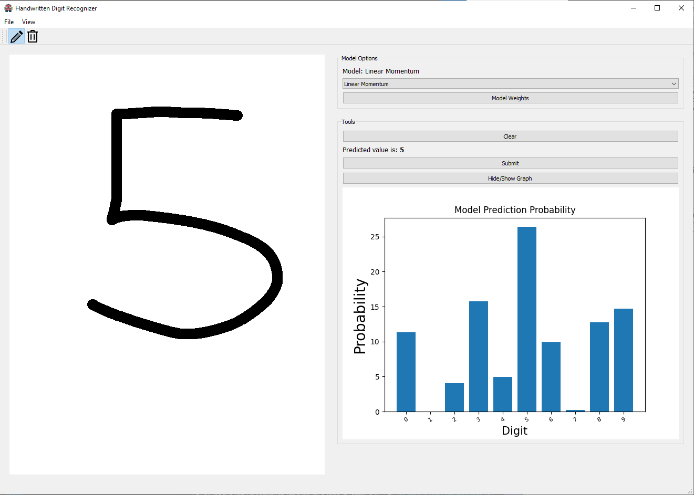

# COMPSYS 302 S1 2021 – Machine Learning Handwritten Digit Recogniser
Mazen Darwish, Callum McDowell

## Overview
This project is an application that trains and uses a machine learning model to recognise handwritten digits. The app is written in Python, with the use of PyQt for the GUI and PyTorch for machine learning. In the app users can download datasets and train a selection of models, and then draw on a canvas and use their trained model to classify the digit. Our research explores linear regression neural networks (NN) and convolutional neural networks (CNN). We used the MNIST handwritten digits dataset to train and test our models.

## Running the Application
You will need to download and compile the application yourself to run it. The required packages for your python 3.8 environment are as detailed in [requirement.md](requirement.md). To launch the application use the provided .vscode/launch.json file, or, if you are using another IDE, simply execute the [main.py](./scripts/main.py) file.

## Versions
### v1.0
Released May 1 2021

The first working version of our app. All main features are completed, including:
- Populated main window toolbar and menus
- The GUI has a drawable canvas, and model selection and canvas submission options
- Support for downloading the MNIST dataset and training multiple models
- Can view dataset images (both testing and training) in a efficient and fast loading image viewer gallery
- Support for predicting with multiple models, and ability to use custom model weights
- Error handling for model training and predictions in case of incorrect or invalid selections
- ... and a few small QoL additions.

### Check out the [assignment project brief](CS302_2021_Project_Brief.pdf) for more detail.